# 🐱 Котолог — каталог твоих будущих котов

**Котолог OFFLINE** — мы вышли в оффлайн! Теперь свайпать котиков можно ещё быстрее, ведь картинки
кэшируются! Кроме того,
счётчики и лист понравившихся кошек теперь хранится в базе данных и сохраняется НАВСЕГДА (ну почти).
Кроме того даже с выключенным интернетом можно свайпать котиков, нооо к сожалению только тех,
которые до этого были в буффере. Ставьте лайки, дизайлки, свайпайте, фильтруйте породы и, конечно,
наслаждайтесь новыми фичами!

---

## 📌 Описание проекта

### Базовые фичи:

- Просмотр фотографий кошек (свайп карточек или кнопками).
- Лайк или дизлайк кошек.
- Просмотр подробной информации о каждой кошке (по нажатию на кнопку "вопрос" или на карточку).
- Отмена последнего лайка или дизлайка.
- Счётчики лайков и дизлайков.
- Динамическое включение/отключение кнопки отмены действия.
- Отдельный экран со списком лайкнутых кошек.
- Фильтрация лайкнутых кошек по породе.
- Удаление кошек из списка свайпом влево.

### Новые фичи:

- Отображение индикатора отсуствия интернета.
- Снекбар с сообщением об пропаже/появлении интернета.
- Теперь котики кешируются, и их можно свайпать даже без интернета.
- Сохранение лайков, дизлайков и карточек в базе данных.
- Тестирование.

## 📸 Обзор

### Главный экран
---

  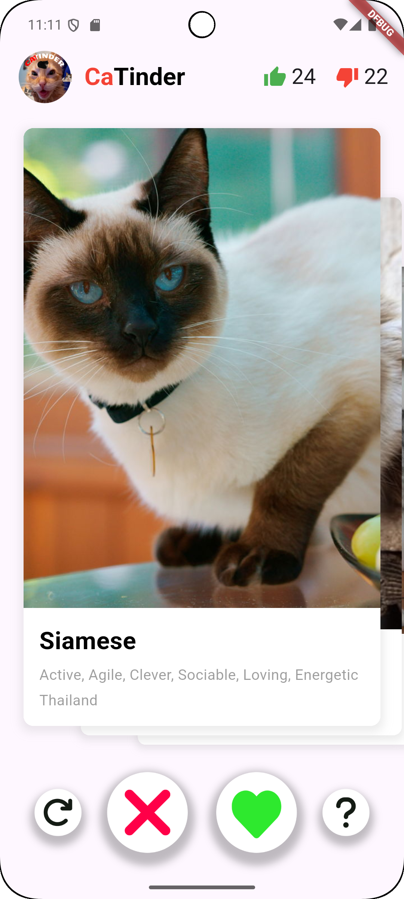  &nbsp
    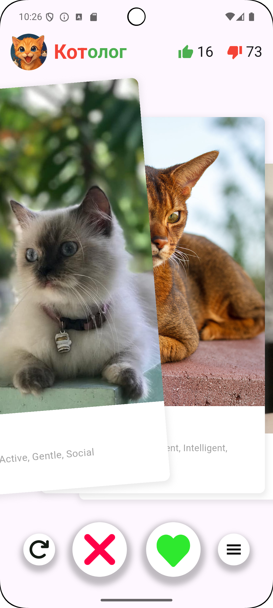

---

### При отсутсвии интернета, появляется индикатор. При появлении интернета, появляется снекбар с 
сообщением об этом. Также добавлен индикатор загрузки и ошибки.
---

  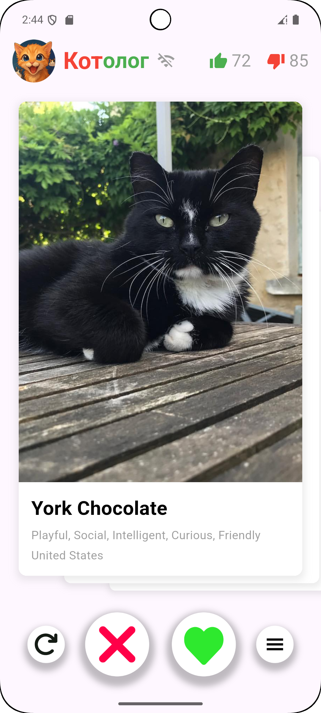 &nbsp
    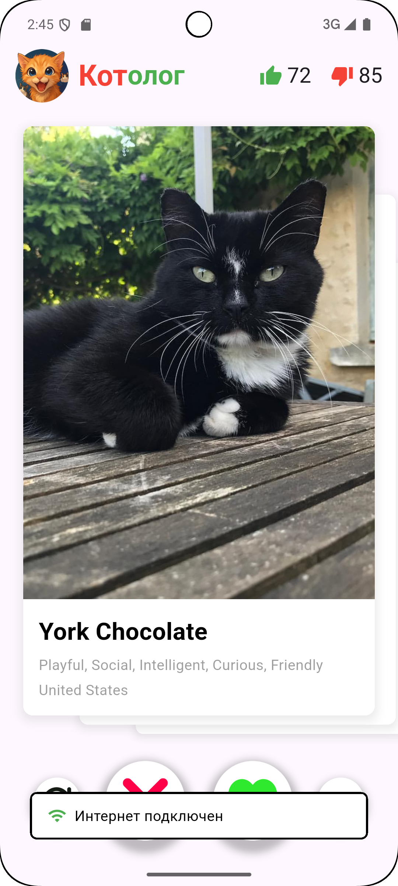&nbsp
    

---

---
### Можно посмотреть детальную информацию, нажав на карточку с котиком. Информацию можно листать. 
Dыход через нажатие на "черный фон" или свайп вниз.
---

  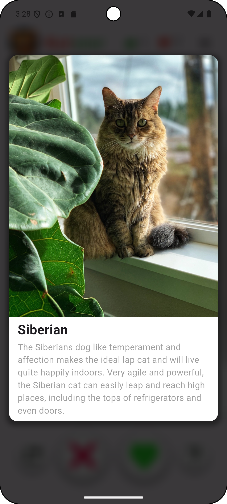&nbsp
  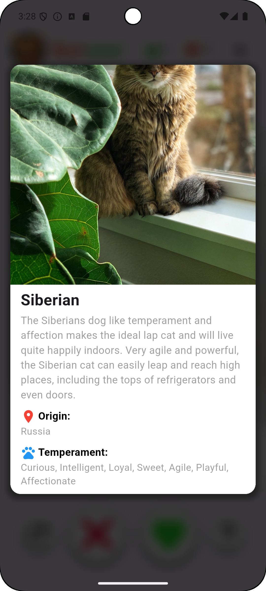&nbsp
  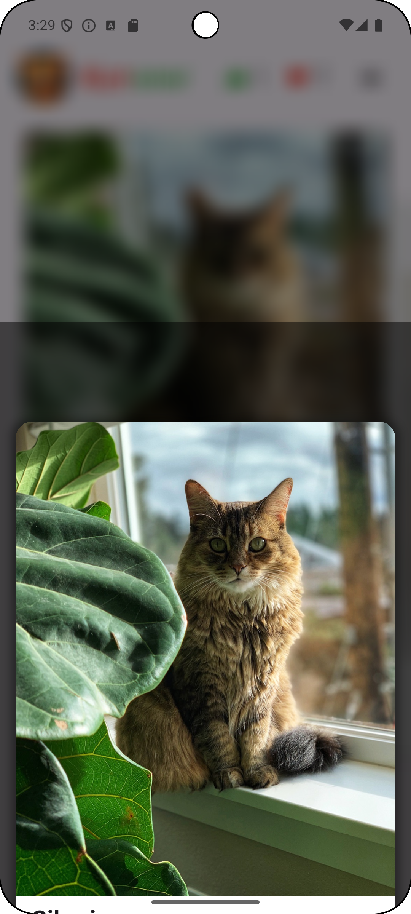

---

### Добавлено меню с лайкнутыми котиками. Удалять котиков можно свайпом влево. Также есть фильтр пород, 
который появляется по нажатию на кнопку. Удаление котиков уменьшает счётчик лайков. Хранение в базе данных с использованием Drift
---

  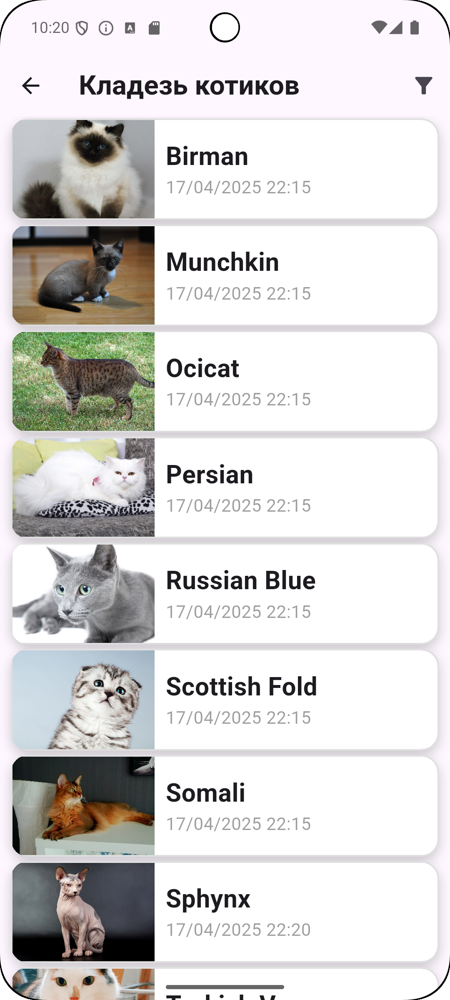&nbsp
  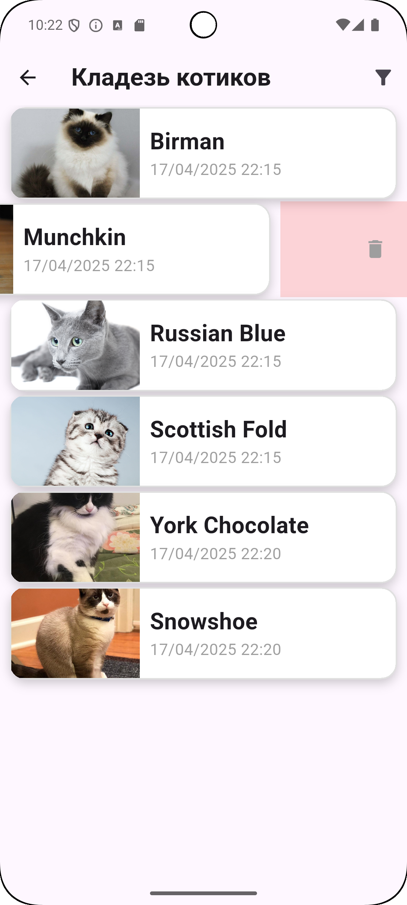&nbsp
  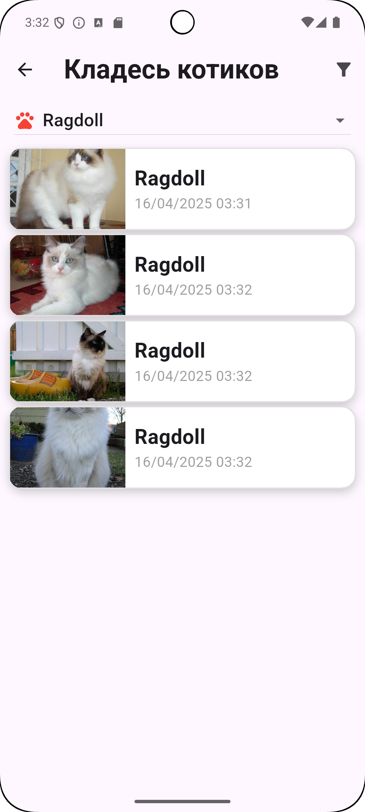&nbsp
  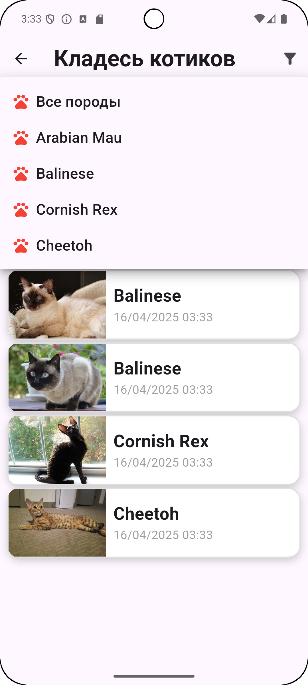

---

## Приколы

- Сделал CI/CD для автоматической проверки тестов

## 📦 Установка

[Скачать OFFLINE версию APK](https://disk.yandex.ru/d/teMmUVDhyMi4WQ)

[Скачать PRO версию APK](https://disk.yandex.ru/d/teMmUVDhyMi4WQ)

[Скачать первую версию APK](https://disk.yandex.ru/d/iTNL7zLFFgohng)