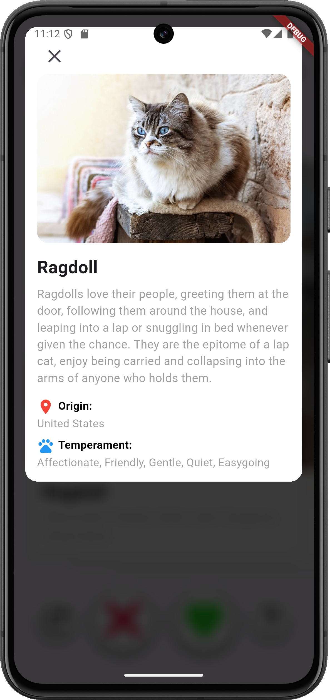
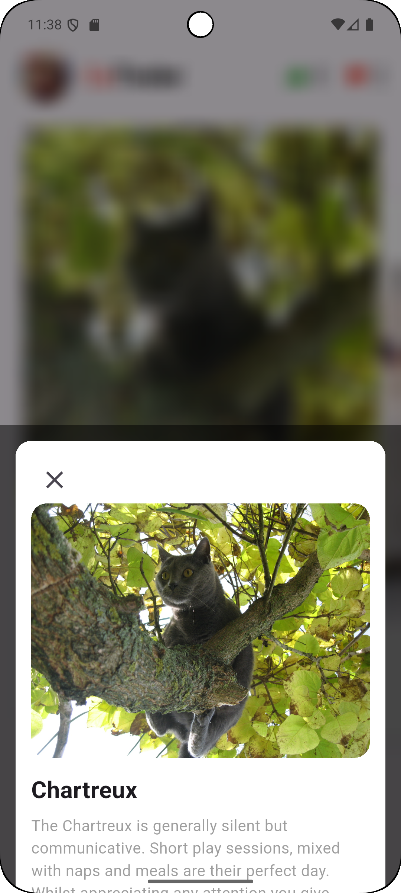

## Описание проекта

CaTinder - это лучшее приложение для любителей кошек! Здесь пользователи могут просматривать фотографии кошек, 
ставить лайки или дизлайки, просматривать подробную информацию и отменять последний лайк или дизлайк. Также сверху видно счётчик лайков и дизлайков и лайков.
Приложение выполнено в минималистичном дизайне с простыми иконками и решениями.

## Реализованные функции

- Просмотр фотографий кошек (свайп или использование кнопок)
- Лайк или дизлайк кошек
- Просмотр подробной информации о каждой кошке на кнопку "вопрос" или по нажатию на карточку
- Отмена последнего лайка или дизлайка
- Счетчики лайков и дизлайков
- Динамическое состояние кнопки отмены

## Интерфейс приложения

## Скачивание

[Скачать последнюю версию APK](https://disk.yandex.ru/d/RBCARTZCkKDqyA)
