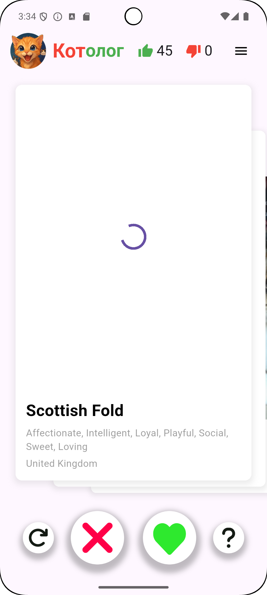
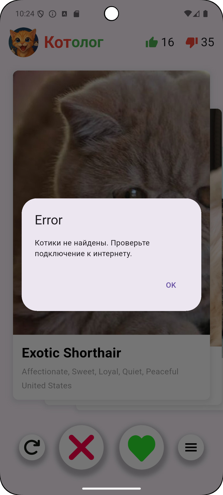

# 🐱 Котолог — каталог твоих будущих котов

**Котолог** — это мобильное приложение, продолжающее идею CaTinder, но теперь ещё круче! У нас
прошёл ребрендинг и дизайн стал лаконичнее. Теперь свайпать котиков стало ещё приятнее! Кроме того,
было добавлено меню с понравившимися котиками, что ну оооочень удобно, чтобы сравнивать разные
породы. Ставьте лайки, дизайлки, свайпайте, фильтруйте породы и, конечно, наслаждайтесь новым
дизайном и иконкой!

---

## 📌 Описание проекта

### Базовые фичи:

- Просмотр фотографий кошек (свайп карточек или кнопками).
- Лайк или дизлайк кошек.
- Просмотр подробной информации о каждой кошке (по нажатию на кнопку "вопрос" или на карточку).
- Отмена последнего лайка или дизлайка.
- Счётчики лайков и дизлайков.
- Динамическое включение/отключение кнопки отмены действия.

### Новые фичи:

- Отдельный экран со списком лайкнутых кошек.
- Фильтрация лайкнутых кошек по породе.
- Удаление кошек из списка свайпом влево.

## 📸 Обзор

### Изменилось название и иконка приложения
---

    &nbsp
    

---

### При плохом соединении появляется индикатор загрузки `CircularProgressIndicator` или ошибка
---

   &nbsp
    

---

---
### Можно посмотреть детальную информацию, нажав на карточку с котиком. Информацию можно листать. По сравнениюс предыдущей версией, был убран крестик. Теперь выход через нажатие на "черный фон" или свайп вниз.
---

  &nbsp
  &nbsp
  

---

### Добавлено меню с лайкнутыми котиками. Удалять котиков можно свайпом влево. Также есть фильтр пород, который появляется по нажатию на кнопку. Удаление котиков уменьшает счётчик лайков. Хранение только в рантайме
---

  &nbsp
  &nbsp
  &nbsp
  

---

## 📦 Установка

[Скачать последнюю версию APK](https://disk.yandex.ru/d/ChAB3NQxRC2R4w)